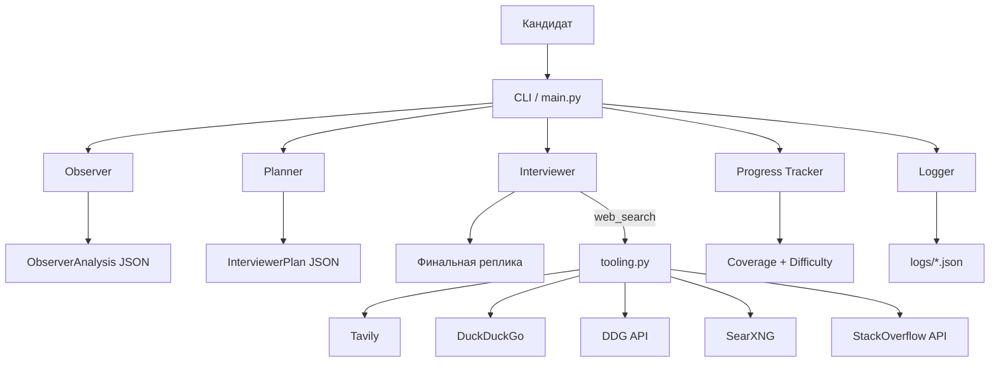
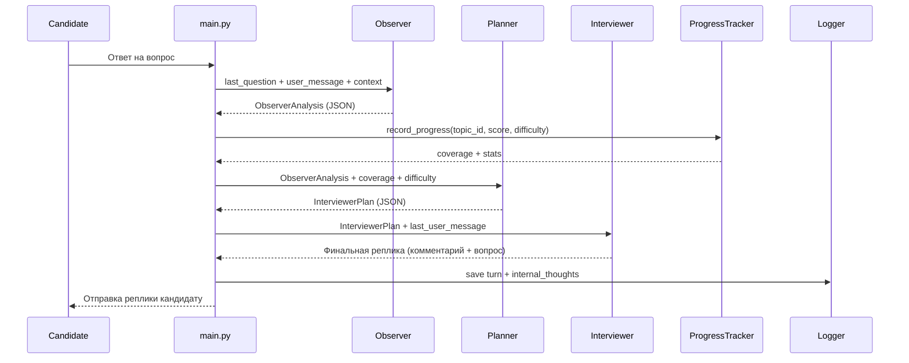

# Interview Coach - профессиональный multi-agent CLI для тренировки техинтервью

**Interview Coach** - CLI-симулятор технического интервью на базе CrewAI. Система моделирует интервьюера, наблюдателя и hiring manager, задает вопросы по плану тем, оценивает ответы, адаптирует сложность и формирует финальный отчет. Проект построен как устойчивый к ошибкам пайплайн с контролем качества, покрытием тем и безопасными fallbacks.

## Ключевые преимущества
- **Профессиональная архитектура**: отдельные агенты с четкими ролями и Pydantic-схемами.
- **Адаптивность**: сложность и выбор тем динамически зависят от ответов, грейда и опыта.
- **Стек-ориентированность**: язык и фреймворк определяются по позиции/опыту и отражаются в темах.
- **Контроль качества**: детект off-topic, prompt-injection, спорных утверждений.
- **Надежность**: строгая валидация JSON, устойчивые fallbacks, deterministic offline-режим.
- **Прозрачность**: детальные логи каждого шага и итоговый отчет.
- **Расширяемость**: темы, эвристики, инструменты и промпты легко кастомизируются.

---

## Архитектура

### Схема архитектуры


### Диаграмма взаимодействия агентов (порядок и сообщения)


### Роли агентов

#### Interviewer (Интервьюер)
**Цель:** вести интервью, удерживать тему, задавать вопросы и давать краткий разбор.
**Что делает:**
- Получает план вопроса (InterviewerPlan) и формирует финальную реплику.
- Дает краткую реакцию/мини-объяснение на ответы кандидата.
- Корректирует неверные ответы и задает уточняющие вопросы.
- Использует web_search при необходимости свежих фактов.

**Использует:**
- `INTERVIEWER_SYSTEM_PROMPT` (`prompts.py`)
- План от Planner (`InterviewerPlan`)
- Инструмент `web_search` через `tooling.py` при сомнениях

#### Observer (Наблюдатель)
**Цель:** объективно оценить ответ кандидата и подсказать следующий шаг.
**Что делает:**
- Определяет intent (NORMAL_ANSWER / OFF_TOPIC / ROLE_REVERSAL / STOP).
- Оценивает корректность (CORRECT/PARTIALLY/INCORRECT/UNKNOWN).
- Выделяет gaps и рекомендует follow-up.
- Фиксирует prompt-injection и спорные утверждения.

**Использует:**
- `OBSERVER_SYSTEM_PROMPT` (`prompts.py`)
- Контекст последних Q/A и текущей темы

#### Hiring Manager
**Цель:** подвести итог интервью и сформировать финальный отчет.
**Что делает:**
- Формирует итоговое решение (grade/decision/confidence).
- Выписывает знания/пробелы и ресурсы для обучения.

**Использует:**
- `HIRING_MANAGER_PROMPT`
- Summary + coverage метрики

### Planner и вспомогательные подсистемы

#### Planner (планировщик следующего шага)
**Где реализован:** `crewai_setup.py` (planner_task), вызывается из `main.py`  
**Задача:** превратить оценку Observer в структурированный план следующего хода.  
**Что делает:**
- Принимает `ObserverAnalysis`, текущую тему, метрики покрытия, уровень сложности и краткую память (recent Q/A, facts).
- Возвращает `InterviewerPlan` (next_action, next_question, topic_id, difficulty).
- Гарантирует, что вопрос остаётся в выбранной теме.

#### Progress Tracker (трекер прогресса)
**Где реализован:** `topics.py` (`ProgressTracker`, `record_progress`, `recalc_coverage`)  
**Задача:** объективно измерять покрытие тем и качество ответов.  
**Что делает:**
- Считает количество заданных вопросов по теме и средний скор.
- Пересчитывает coverage (`must`, `overall`) и статус темы (pending → in_progress → covered).
- Влияет на остановку интервью при достижении целевого покрытия.

#### Topic Engine (выбор темы)
**Где реализован:** `topics.py` (`select_next_topic`)  
**Что делает:**
- Выбирает следующую тему с приоритетом must.
- Учитывает cooldown, coverage и средний скор.
- Для Senior делает стартовый сдвиг к system design/конкурентности.

---

### Поток выполнения (упрощенно)
```
Пользователь -> CLI (main.py)
  -> Observer: анализ ответа -> ObserverAnalysis (JSON)
  -> Planner: формирует InterviewerPlan
  -> Interviewer: финальная фраза (реакция + вопрос)
  -> Progress: обновление покрытия тем и сложности
  -> Logger: сохранение шага
```

---

## Компоненты и их функции
- `main.py` - главный цикл интервью, сбор профиля, выбор тем, смена сложности, интеграция агентов.
- `crewai_setup.py` - создание агентов, описание задач, интеграция промптов и инструментов.
- `prompts.py` - системные правила поведения агентов (стиль, контент, безопасность).
- `topics.py` - построение TopicPlan, выбор темы, трекинг покрытия, адаптация стека.
- `topic_catalog.py` - каталог тем для Backend по грейдам.
- `logic.py` - эвристики intent/off-topic/prompt-injection/controversial.
- `tooling.py` - web_search инструмент и его fallback цепочка.
- `schemas.py` - строгие Pydantic модели (ObserverAnalysis, InterviewerPlan, FinalFeedback).
- `logger.py` - запись логов и итогового отчета.
- `scenario_runner.py` - запуск сценариев для тестов и демо.

---

## Память системы (Memory)
Система хранит состояние в `SessionState` (`schemas.py`) и использует несколько слоёв памяти:
- **История диалога:** `state.history` (все ходы с вопросом/ответом).  
- **Краткое резюме:** `state.running_summary` формируется из последних 3 ходов.  
- **Факты из ответов:** `state.extracted_facts` (короткие фрагменты, используемые в последующих вопросах).  

Где используется память:
- `_recent_qa_text()` и `_known_facts_text()` передаются Observer/Planner для контекста.  
- `question_already_covered()` предотвращает повторы вопросов.  
- В логах `internal_thoughts` сохраняются метрики и выбранная тема.  

Память **детерминирована и прозрачна**: всё, что влияет на поведение, сохраняется в логах.

### Диаграмма Memory Flow
```mermaid
flowchart TD
    U[Кандидат] --> A[Ответ]
    A --> EX[extract_facts()]
    A --> SUM[update_summary()]
    EX --> FACTS[state.extracted_facts]
    SUM --> RSUM[state.running_summary]
    HIST[ConversationTurn] --> H[state.history]

    FACTS --> KN[_known_facts_text()]
    RSUM --> RQ[_recent_qa_text()]
    H --> RQ

    KN --> OBS[Observer Task]
    RQ --> OBS
    KN --> PL[Planner Task]
    RQ --> PL

    H --> QAC[question_already_covered()]
    QAC --> INT[Interviewer]
```

---

## Workflow мультиагентной системы (пошагово)
1. **Сбор профиля** (имя, позиция, грейд, опыт).  
2. **Построение TopicPlan** с учётом грейда/опыта/стека.  
3. **Выбор стартовой темы** и уровня сложности.  
4. **Interviewer** задаёт первый вопрос.  
5. **Кандидат отвечает.**  
6. **Observer** анализирует ответ и выдаёт `ObserverAnalysis`.  
7. **Progress Tracker** обновляет метрики покрытия и сложности.  
8. **Planner** формирует `InterviewerPlan` (действие + следующий вопрос).  
9. **Interviewer** формирует финальную реплику (реакция + вопрос).  
10. Цикл повторяется, пока не достигнуты лимит вопросов или target coverage.  
11. **Hiring Manager** формирует финальный отчёт с результатами и рекомендациями.  

---

## Как учитывается грейд и опыт
- Стартовая сложность: Junior=2, Middle=3, Senior=4.
- Если опыт >= 8 лет, сложность повышается на 1 (до 5).
- Если опыт <= 1 года, сложность понижается на 1.
- Для Senior есть стартовый приоритет system design/конкурентности.

---

## Как используются темы и стек
- Базовый каталог тем - `topic_catalog.py`.
- План зависит от грейда (Junior/Middle/Senior).
- Язык и фреймворк определяются по позиции/опыту и переименовывают темы
  (например, `Java basics`, `Spring / Framework basics`).
- Must темы требуют минимального числа вопросов и достаточной средней оценки.

---

## Web Search: как используется
Инструмент web_search реализован в `tooling.py` и подключается к Interviewer.

**Алгоритм:**
1. Сначала используется Tavily (если задан `TAVILY_API_KEY`).
2. Если Tavily недоступен - DuckDuckGo через `duckduckgo_search`.
3. Далее fallback - DuckDuckGo Instant Answer API.
4. Далее - SearXNG (если задан `SEARX_URL`).
5. Последний fallback - StackOverflow Search API.

**Особенности:**
- Результаты кэшируются в памяти (`_CACHE`) для снижения нагрузки и ускорения.
- Интервьюер использует web_search только при неуверенности в фактах.
- Инструмент всегда безопасен: возвращает пустой список при ошибках.

---

## Почему решение выглядит профессионально
- **Многоуровневая валидация** (Pydantic + fallback JSON-парсинг).
- **Стабильность** (offline stub, retry при ошибках, устойчивые fallbacks).
- **Управляемость** (ограничение длины ответов, строгие правила в промптах).
- **Метрики качества** (coverage, difficulty, scoring, confidence).
- **Модульность** (каждый блок можно заменить или расширить без переписывания ядра).

---

## Установка
```powershell
python -m venv .venv
.\.venv\Scripts\Activate.ps1
pip install -r requirements.txt
pip install -e .
```

---

## Конфигурация
Без ключей включается deterministic offline stub.

Переменные окружения:
- `OPENAI_API_KEY` - ключ OpenAI (или OpenRouter, если начинается с `sk-or-`).
- `ANTHROPIC_API_KEY` - ключ Anthropic.
- `MODEL_NAME` - модель (по умолчанию `gpt-4o-mini`).
- `OPENROUTER_API_KEY`, `OPENROUTER_MODEL`, `OPENROUTER_BASE_URL` - параметры OpenRouter.
- `TAVILY_API_KEY` - Tavily (приоритетный web_search).
- `SEARX_URL` - SearXNG fallback.
- `MOCK_MODE=true` - принудительный offline stub.

---

## Запуск
### Интерактивно
```powershell
python -m interview_coach
```
или
```powershell
python -m interview_coach.main --name "Иван" --position "Backend" --grade "Middle" --experience "3 года"
```

Система обязательно собирает профиль кандидата: имя, позиция, грейд, опыт.

Команды во время интервью:
- `Стоп интервью`, `Стоп игра`, `Давай фидбэк`, `stop`, `/stop`
- `Прогресс` - сводка покрытия тем

### Сценарии
```powershell
python -m interview_coach.scenario_runner scenarios/example_secret_scenario.json
```

---

## Логи
Логи сохраняются в `logs/interview_log_YYYYMMDD_HHMMSS.json`.

Пример формата:
```json
{
  "participant_name": "...",
  "turns": [
    {
      "turn_id": 1,
      "agent_visible_message": "...",
      "user_message": "...",
      "internal_thoughts": "[Observer]: ..."
    }
  ],
  "final_feedback": { ... }
}
```

---

## Как адаптировать под свой стек
1. Обновите `topic_catalog.py` для новых ролей/тем.
2. Добавьте ключевые слова языков/фреймворков в `topics.py`.
3. Настройте поведение агентов в `prompts.py`.

---

## Тесты
```powershell
pytest
```

---

## Ограничения
- Эвристики intent/off-topic не идеальны.
- Глубина ответов зависит от LLM и правил в промпте.
- Для стабильного web_search лучше использовать `TAVILY_API_KEY`.
